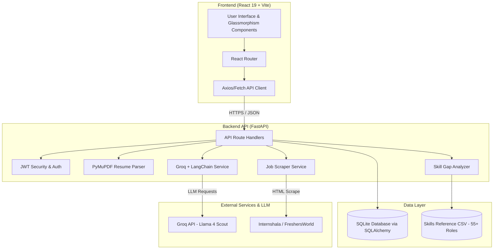

# SkillSync 🚀

**AI-Powered Resume Analysis, Skill Gap Detection & Career Guidance**

[](https://skill-sync-ai-lovat.vercel.app)
[](https://skillsync-2ltw.onrender.com/)
[](https://react.dev/)
[](https://fastapi.tiangolo.com/)
[](https://python.org)
[](https://groq.com)
[](LICENSE)

SkillSync is an end-to-end web platform designed to bridge the gap between job seekers' current qualifications and market demand. By integrating intelligent PDF resume parsing, domain-specific skill matching, LLM-backed career coaching via **Groq & LangChain**, and real-time job listings scraped from top job portals, SkillSync equips users with actionable roadmaps to elevate their career trajectory.

---

## 🌐 Live Demos

- **Frontend App (Vercel):** [https://skill-sync-ai-lovat.vercel.app](https://skill-sync-ai-lovat.vercel.app)
- **Backend API (Render):** [https://skillsync-2ltw.onrender.com](https://skillsync-2ltw.onrender.com)
- **Interactive OpenAPI Specs:** [https://skillsync-2ltw.onrender.com/docs](https://skillsync-2ltw.onrender.com/docs)

---

## ✨ Features

### 📄 Intelligent Resume & Profile Analysis
- **PDF Resume Parser:** Extracts text, contact info, and technical skills seamlessly using PyMuPDF.
- **Auto-Role Detection:** Compares extracted skills against a dictionary of **55+ specialized tech roles** to automatically detect your best fit.
- **LinkedIn Profile Import:** Fetch and evaluate skills directly from public LinkedIn profile URLs.
- **Side-by-Side Comparison:** Compare two versions of a resume against a target role to quantify revision improvements.

### 💡 AI Career Coach & Skill Gap Visualization
- **Skill Radar & Matrix:** Visual breakdown of Matched vs. Missing skills for target job descriptions.
- **AI-Powered Learning Roadmaps:** Generates custom step-by-step learning schedules, course suggestions, and actionable project ideas using Groq (Llama models) and LangChain.
- **Personalized Resume Feedback:** Provides targeted recommendations to improve resume phrasing, formatting, and impact.

### 🔍 Automated Job Discovery & Scraper
- **Real-Time Job Indexing:** Scrapes active job listings from platforms like Internshala and FreshersWorld.
- **Smart Filtering:** Filter jobs by domain role, experience level, location, and keywords.
- **Bookmark & Saved Jobs:** Save job posts to your personal shortlist for quick access.

### 🗂️ Application Kanban Tracker
- **Drag-and-Drop Workflow:** Track applications across **Wishlist**, **Applied**, **Interview**, and **Offered** stages.
- **Metrics & History:** Monitor response rates and view total application statistics over time.

### 🔐 User & Admin Management
- **Role-Based Auth (JWT):** Secure user registration, authentication, and role checking (`Admin` vs `User`).
- **User Dashboard & History:** View past analysis history, track score progression, and edit skill profiles.
- **Admin Panel:** Complete control dashboard to view platform stats, manage users, update job posts manually, and inspect scraper logs.

---

## 🏗️ System Architecture



---

## 🛠️ Tech Stack

| Domain | Technologies |
|---|---|
| **Frontend** | React 19, Vite, React Router v7, React Markdown, jsPDF |
| **Backend** | FastAPI, Python 3.10+, Uvicorn, Pydantic v2 |
| **Database & ORM** | SQLite, SQLAlchemy ORM |
| **AI / LLM** | Groq API (`langchain-groq`), LangChain |
| **Parsing & Scraping** | PyMuPDF (fitz), BeautifulSoup4, Requests |
| **Security & Auth** | PyJWT, Passlib / Email-Validator |
| **Hosting & CI/CD** | Vercel (Frontend), Render (Backend), GitHub Actions (Keep-Alive Cron) |

---

## 🚀 Getting Started

### Prerequisites

Ensure you have the following installed locally:
- **Node.js** v18.x or higher & `npm`
- **Python** 3.10 or higher
- **Groq API Key** (Free tier available at [console.groq.com](https://console.groq.com/keys))

---

### 1. Repository Setup

```bash
git clone https://github.com/VIKASGULIA17/SkiilSync.git
cd SkiilSync
```

---

### 2. Backend Setup

1. Navigate to the `backend` directory:
   ```bash
   cd backend
   ```

2. Create and activate a Python virtual environment:
   ```bash
   # On Linux/macOS:
   python3 -m venv venv
   source venv/bin/activate

   # On Windows:
   python -m venv venv
   venv\Scripts\activate
   ```

3. Install required Python packages:
   ```bash
   pip install -r requirements.txt
   ```

4. Create environment variables:
   Create a `.env` file in the `backend/` directory:
   ```env
   GROQ_API_KEY=your_groq_api_key_here
   DATABASE_URL=sqlite:///./data/skillsync.db
   SKILLS_CSV_PATH=./data/skills_data.csv
   SCRAPE_ON_STARTUP=false
   JWT_SECRET_KEY=your_custom_jwt_secret_key
   ```

5. Launch the FastAPI development server:
   ```bash
   uvicorn app.main:app --reload --port 8000
   ```
   *The backend will run at `http://localhost:8000`. Interactive API Swagger docs are accessible at `http://localhost:8000/docs`.*

---

### 3. Frontend Setup

1. Open a new terminal tab and navigate to `frontend`:
   ```bash
   cd frontend
   ```

2. Install Node dependencies:
   ```bash
   npm install
   ```

3. Start the Vite dev server:
   ```bash
   npm run dev
   ```
   *The frontend application will launch at `http://localhost:5173`.*

---

## ⚙️ Environment Variables

### Backend Configuration (`backend/.env`)

| Variable | Type | Default | Description |
|---|---|---|---|
| `GROQ_API_KEY` | String | `None` | API key for Groq LLM inference. *(Can also be configured dynamically in UI Settings)* |
| `DATABASE_URL` | String | `sqlite:///./data/skillsync.db` | SQLAlchemy database connection URI. |
| `SKILLS_CSV_PATH` | String | `./data/skills_data.csv` | Relative path to role-skills mapping dataset. |
| `SCRAPE_ON_STARTUP` | Boolean | `True` | Whether to execute job scraper on app startup if DB is empty. |
| `SCRAPE_INTERVAL_HOURS` | Integer | `24` | Automated background scrape interval in hours. |
| `JWT_SECRET_KEY` | String | `skillsync_secret...` | Secret key used for signing JWT tokens. |
| `JWT_ALGORITHM` | String | `HS256` | Token hashing algorithm. |
| `ACCESS_TOKEN_EXPIRE_MINUTES` | Integer | `1440` | JWT expiration duration in minutes (24 hours). |

---

## 📁 Project Directory Structure

```
SkiilSync/
├── .github/
│   └── workflows/
│       └── keep_alive.yml      # GitHub Action to keep Render backend warm
├── backend/
│   ├── app/
│   │   ├── main.py             # FastAPI entry point, middleware & hooks
│   │   ├── config.py           # Pydantic environment configuration
│   │   ├── database.py         # SQLAlchemy engine & session factory
│   │   ├── models.py           # DB models (User, Profile, Job, History, etc.)
│   │   ├── schema.py           # Pydantic request/response schemas
│   │   ├── routes/             # Modular API endpoints
│   │   │   ├── admin.py        # /api/admin endpoints
│   │   │   ├── auth.py         # /api/auth endpoints
│   │   │   ├── jobs.py         # /api/jobs endpoints
│   │   │   ├── profile.py      # /api/user_profile endpoints
│   │   │   ├── resume.py       # /api/analyze endpoints
│   │   │   ├── settings.py     # /api/settings endpoints
│   │   │   ├── skills.py       # /api/roles endpoints
│   │   │   └── user.py         # /api/user endpoints
│   │   └── services/           # Core business logic
│   │       ├── ai_feedback.py  # Groq/LangChain AI coaching
│   │       ├── gap_analyzer.py # Skill gap math & percentage match
│   │       ├── job_scraper.py  # Internshala & FreshersWorld scrapers
│   │       ├── resume_parser.py# PyMuPDF text & skill extractor
│   │       ├── security.py     # JWT & password hashing
│   │       └── skills_db.py    # Role dictionary loader
│   ├── data/
│   │   └── skills_data.csv     # 55+ tech role skills database
│   └── requirements.txt        # Python backend dependencies
├── frontend/
│   ├── src/
│   │   ├── api/                # API Client & Axios configuration
│   │   ├── components/         # Reusable UI components (JobCard, Radar, SkillChips, etc.)
│   │   ├── context/            # Auth & state management contexts
│   │   ├── pages/              # Main application views (Dashboard, Analyze, Jobs, etc.)
│   │   ├── App.jsx             # Main Router & view orchestration
│   │   └── index.css           # Global CSS variables & glassmorphism theme
│   ├── package.json
│   └── vite.config.js
├── vercel.json                 # Vercel SPA routing rewrite rules
└── README.md
```

---

## 🔌 Complete API Endpoints Reference

### 🔑 Authentication (`/api/auth`)
| Method | Endpoint | Description |
|---|---|---|
| `POST` | `/api/auth/signup` | Register new user account |
| `POST` | `/api/auth/login` | Authenticate user and issue JWT bearer token |
| `GET` | `/api/auth/me` | Fetch current authenticated user info |
| `GET` | `/api/auth/is_admin` | Verify if user has admin privileges |
| `GET` | `/api/auth/is_user` | Verify if user has standard user role |

### 📄 Resume Analysis (`/api/analyze`)
| Method | Endpoint | Description |
|---|---|---|
| `POST` | `/api/analyze` | Upload PDF resume to parse skills & match against top roles |
| `POST` | `/api/analyze/feedback` | Generate AI-driven resume improvement suggestions |
| `POST` | `/api/analyze/role` | Perform targeted skill analysis for a specific job role |
| `POST` | `/api/analyze/linkedin` | Fetch & analyze skills from a LinkedIn profile URL |
| `POST` | `/api/analyze/compare` | Compare two PDF resumes side-by-side against a role |

### 👤 User Data & Applications (`/api/user`)
| Method | Endpoint | Description |
|---|---|---|
| `GET` | `/api/user/history` | Retrieve personal analysis history logs |
| `POST` | `/api/user/history` | Record a new resume analysis entry |
| `GET` | `/api/user/stats` | Fetch application metrics and progress stats |
| `GET` | `/api/user/applications` | Get tracked job applications for Kanban board |
| `POST` | `/api/user/applications` | Create new tracked job application |
| `PATCH` | `/api/user/applications/{id}`| Update application stage (Wishlist/Applied/Interview/Offered) |
| `DELETE`| `/api/user/applications/{id}`| Remove tracked application |
| `GET` | `/api/user/saved-jobs` | List bookmarked jobs |
| `POST` | `/api/user/saved-jobs` | Bookmark a job post |
| `DELETE`| `/api/user/saved-jobs/{id}` | Remove job from bookmarks |

### 📋 User Profile (`/api/user_profile`)
| Method | Endpoint | Description |
|---|---|---|
| `GET` | `/api/user_profile` | Fetch complete user profile data |
| `POST` | `/api/user_profile/personalInfo/update` | Update user personal details & social links |
| `POST` | `/api/user_profile/skill_set/update` | Update user skill matrix |

### 💼 Jobs & Roles (`/api/jobs`, `/api/roles`)
| Method | Endpoint | Description |
|---|---|---|
| `GET` | `/api/jobs` | Search & filter indexed jobs with pagination |
| `POST` | `/api/jobs/refresh` | Trigger background scraper for new jobs |
| `GET` | `/api/jobs/status` | Check live job scraper status |
| `GET` | `/api/roles` | Retrieve list of all 55+ supported roles |

### ⚙️ Settings (`/api/settings`)
| Method | Endpoint | Description |
|---|---|---|
| `POST` | `/api/settings/api-key` | Dynamically update Groq API Key at runtime |
| `GET` | `/api/settings/api-key/status` | Check whether a valid Groq API key is set |

### 🛡️ Admin Operations (`/api/admin`)
| Method | Endpoint | Description |
|---|---|---|
| `GET` | `/api/admin/stats` | Retrieve platform-wide metrics (Users, Jobs, Analyses) |
| `GET` | `/api/admin/users` | List all platform users |
| `GET` | `/api/admin/users/{id}` | Get detailed profile of a specific user |
| `PATCH` | `/api/admin/users/{id}/role` | Promote/demote user roles (`admin` / `user`) |
| `DELETE`| `/api/admin/users/{id}` | Delete user account |
| `POST` | `/api/admin/jobs` | Manually insert job posting |
| `PUT` | `/api/admin/jobs/{id}` | Modify existing job posting |
| `DELETE`| `/api/admin/jobs/{id}` | Delete job posting |
| `GET` | `/api/admin/scraper/logs` | Fetch historical job scraper logs |

---

## 🤝 Contributing

Contributions, issues, and feature requests are welcome!

1. **Fork** the repository
2. Create a new branch: `git checkout -b feature/amazing-feature`
3. Commit your changes: `git commit -m 'Add some amazing feature'`
4. Push to your branch: `git push origin feature/amazing-feature`
5. Open a **Pull Request**

---

## 📄 License

Distributed under the MIT License. See `LICENSE` for more information.